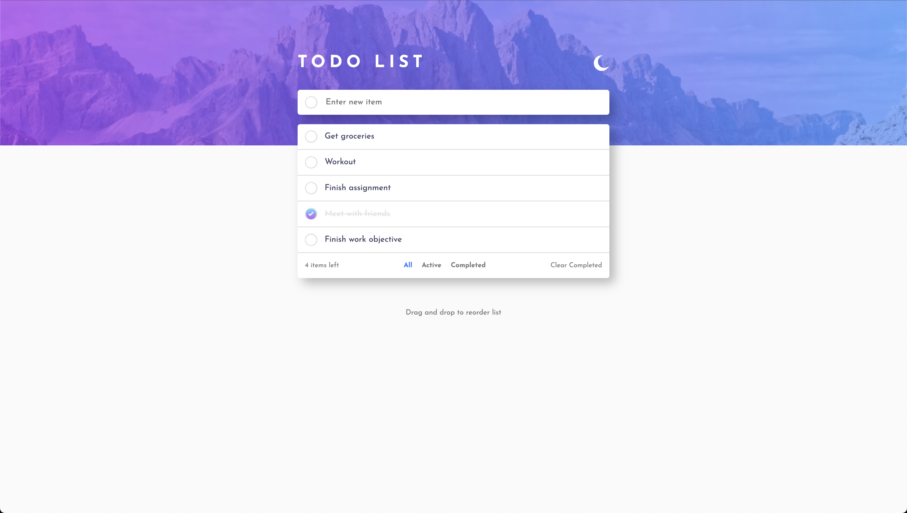

# Frontend Mentor - Todo app solution

This is a solution to the [Todo app challenge on Frontend Mentor](https://www.frontendmentor.io/challenges/todo-app-Su1_KokOW). Frontend Mentor challenges help you improve your coding skills by building realistic projects. 

## Table of contents

- [Overview](#overview)
  - [The challenge](#the-challenge)
  - [Screenshot](#screenshot)
  - [Links](#links)
- [My process](#my-process)
  - [Built with](#built-with)
  - [What I learned](#what-i-learned)
  - [Continued development](#continued-development)
  - [Useful resources](#useful-resources)
- [Author](#author)

## Overview

### The challenge

Users should be able to:

- View the optimal layout for the app depending on their device's screen size
- See hover states for all interactive elements on the page
- Add new todos to the list
- Mark todos as complete
- Delete todos from the list
- Filter by all/active/complete todos
- Clear all completed todos
- Toggle light and dark mode
- **Bonus**: Drag and drop to reorder items on the list

### Screenshot



### Links

- Solution URL: [GitHub](https://your-solution-url.com)
- Live Site URL: [GitHub Live](https://your-live-site-url.com)

## My process

### Built with

- Semantic HTML5 markup
- CSS custom properties
- Flexbox
- Mobile-first workflow

### What I learned

This is the drag and drop code below:

```js
listItem.draggable = true;

        listItem.addEventListener('dragstart', e => {
            draggedItem = e.target;
        });

        listItem.addEventListener('dragover', e => {
            e.preventDefault();
        });

        listItem.addEventListener('dragenter', e => {
            e.target.classList.add('drag-over');
        });

        listItem.addEventListener('dragleave', e => {
            e.target.classList.remove('drag-over');
        });

        listItem.addEventListener('drop', e => {
            e.target.classList.remove('drag-over');
            if (draggedItem !== null) {
                const items = Array.from(itemsList.getElementsByClassName('list-item'));
                const currentIndex = items.indexOf(e.target);
                const draggedIndex = items.indexOf(draggedItem);
                if (currentIndex > draggedIndex) {
                    itemsList.insertBefore(draggedItem, e.target.nextSibling);
                } else {
                    itemsList.insertBefore(draggedItem, e.target);
                }
                draggedItem = null;
            }
        });
```

### Continued development

I need to learn how to do implement more advanced interactive features such as the drag and drop.

### Useful resources

- [W3Schools](https://www.w3schools.com) - This site helps me whenever I need a reminder of how to use certain code
- [ChatGPT](https://www.chatgpt.com) - This helped me with the code for the dragg & drop feature

## Author

- Frontend Mentor - [@rnsnceman](https://www.frontendmentor.io/profile/rnsnceman)
- Instagram - [@yurikoller](https://www.instagram.com/yurikoller)